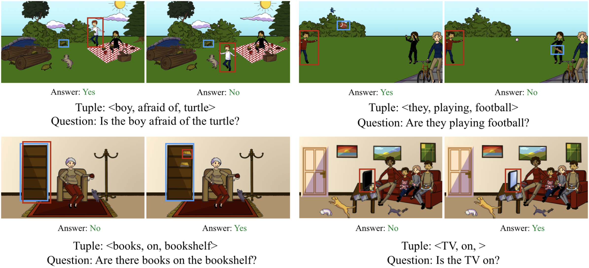

# vqa-research
Binary answer to the question on the image



# Prerequisites 

**Backend:** please use *application/requirements.txt* in order to compile the environment for the application. 

**Model:** the experiments were conducted with `CUDA 10.1` and `torch 1.8.1`. The following libraries must be compatible with this software setup:
```
- torch-cluster==1.6.0
- torch-geometric==2.1.0.post1
- torch-scatter==2.0.8
- torch-sparse==0.6.12
- torch-spline-conv==1.2.1
```
All other external libraries, which do not depend on `torch` and `CUDA` versions, are mentioned in `/model/requirements.txt`.

# Contact us

If you have some questions about the code, you are welcome to open an issue, I will respond to that as soon as possible.
